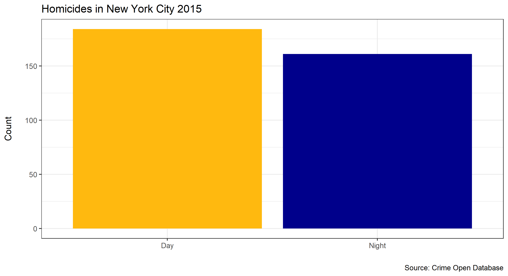

# Known to novel

A new month means a new [challenge](https://community.storytellingwithdata.com/challenges/sep-2022-known-to-novel) over at the blog of *Storytelling with Data*.
The task was to create a data visualization by going from known to unknown graphs. But in addition explain the process in a way an audience could follow along.
Some interesting data comes with the *crimedata* pacakge and I though about different possibilities to visualize the data. I did enjoy the this process a lot
and decided to write a quick tutorial since I encountered some difficulties in producing the final plots. 

# Setup

As mentioned, I used data from the *crimedata* package, as well as the packages *tidyverse* and *lubridate* for data wrangling. For producing the maps and plots
I used *ggplot*, *ggpubr*, *ggmap*, *sf*, and *scatterpie*. Load the packages individually or use the awesome package *pacman* to install and load packages simultaneously.

```r
library(crimedata)
library(tidyverse)  # Also loads ggplot2
library(lubridate)
library(ggpubr)
library(ggmap)
library(sf)
library(scatterpie)

# Or with the function p_load() {pacman}
pacman::p_load(crimedata, tidyverse, lubridate, ggpubr, ggmap, sf, scatterplot)
```

# Data preparation

After loading all packages we can begin by preparing our data. I used the **homicides14** dataset, which contains homicide records from the year 2015 of nine
large US cities. I decided to use the data from New York City and to investigate the distribution of homicides between day and night. I defined daytime
as the time between 8 AM and 10 PM. A little bit arbitrary and there is an uneven split between day (= 14 h) and night (= 8 h), but check for yourself how
the final visualization changes if different splits or more classes (e.g., afternoon, evening, ...) are used! All the steps can easily be done using the
pipe operator.

```r
# Prepare data
dt <- homicides15 %>%
    
    # Filter rows
    filter(grepl("New York", city_name)) %>%
    
    # Select columns
    select(city_name, offense_type, date_single, longitude, latitude) %>%
    
    # Round coordinates for a simpler visualization
    mutate(lon_round = round(longitude, 1),
           lat_round = round(latitude, 1)) %>%
    
    # Add category for daytime
    mutate(daytime = case_when(
        hour(date_single) >= 8 & hour(date_single) < 22 ~ "Day",
        TRUE ~ "Night"
    ))

# Inspect data
head(dt)
```

# From simple ...

There are several ways to visualize this data by looking at a few variables such as distribution of homicides between day and night or spatial patterns. Let's start with the former and check if there is a difference between day and night. We use *ggplot* to produce a simple bar chart. First we need to count 
the number of homicides for each daytime. Again we can use pipes in combination with *ggplot* to produce a nice looking plot.

```r
dt %>%

    # Group by daytime and count number of homicides by grouped variable
    group_by(daytime) %>%
    count(offense_type) %>%
    
    # Plot data
    ggplot(simple_prep, aes(x = daytime, y = n, fill = daytime)) +
        geom_bar(stat = "identity") +
        scale_fill_manual(values = c("darkgoldenrod1", "darkblue")) +
        labs(title = "Homicides in New York City 2015",
             caption = "Source: Crime Open Database",
             x = "",
             y = "Count\n") +
        theme_bw() +
        theme(legend.position = "none")
```

We can use `labs()` to reference important plot elements, such as title, subtitle, captions, axis labels, etc. ... For the final plot I added some color, a title and referenced the data source given in the *crimedata* package (Fig. 1). 

<figure>

<figcaption>Fig 1. Homicides in New York City in the year 2015. More homicides are commited during daytime.</figcaption>
</figure>




This is already quiet nice, but is there also a spatial pattern? Spatial coordinates are given in the dataset and we can look at the same distribution of homicides but add the additional information of distribution for longitude and latitude. Again we group the data by daytime and longitude or latitude respectively. Note that we use rounded coordinates to roughly group the data. I used the *ggpubr* package to arrange the plots next to each other.

```r
# Plot distribution of homicdes along the longitudinal coordinates
lon_p <- dt %>%
    group_by(lon_round, daytime) %>%
    count(offense_type) %>%
    
    # Plot data
    ggplot(lon_prep, aes(x = lon_round, y = n, fill = daytime)) +
    geom_bar(stat = "identity", position = "dodge") +
    scale_fill_manual(values = c("darkgoldenrod1", "darkblue")) +
    labs(title = "Longitudinal distribution of homicides",
         caption = " ", # This is a blank to have plots formated in the same manner
         x = "Longitude",
         y = "No. of homicides\n",
         fill = "Daytime") +
    theme_bw()
    
# Plot distribution of homicdes along the latitudinal coordinates
lat_p <- dt %>%
    group_by(lat_round, daytime) %>%
    count(offense_type) %>%
    
    # Plot data
    ggplot(lon_prep, aes(x = lat_round, y = n, fill = daytime)) +
        geom_bar(stat = "identity", position = "dodge") +
        scale_fill_manual(values = c("darkgoldenrod1", "darkblue")) +
        labs(title = "Latitudinal distribution of homicides",
             caption = "Source: Crime Open Database",
             x = "Longitude",
             y = "No. of homicides\n",
             fill = "Daytime") +
        theme_bw()
    
# Arrange plots
ggarrange(lon_p, lat_p, common.legend = TRUE, legend = "bottom")
```

I used the same colors as for the first bar plot and changed the titles accordingly (Fig. 2). For a better comparison I also changed the scale of the y-axis.

<figure>

<figcaption>Fig 2. More homicides are commited in the center. But there is a difference between day and night along the longitude and latitude.</figcaption>
</figure>

By now we produced a bunch of nice plots and compared two to three variables (number of homicides versus daytime and spatial coordinates). Visualizing spatial patterns with bar plots is pretty abstract, maybe there is a better way.

# ... to complex

There are several ways I thought about how to visualize this in a more intuitive manner. First, I want to use the coordinate pairs like they are used on a map. This way we can easily see where a homicide was happening. It also allows us to see if there are any dangerous areas where a lot of homicides are
happening. Second, we can control the size of the points we are plotting to see how many homicides were happening at the exact same location. Third, we can roudn coordinate pairs to look at the bigger picture and check for differences between daytime and the number of homicides. This is a lot of information, so lets start by plotting the homicides by their coordinates pairs, and control the size of the points to see if there are areas where more homicides are happening. Note, that we use the exact coordinate pairs.

```r
# Prepare data in a similar manner as before
dt %>%
    group_by(longitude, latitude) %>%
    count(offense_type) %>%
    rename(Count = n) %>%
    
    # Plot data
    ggplot(bubble_prep, aes(x = longitude, y = latitude)) +
        geom_point(aes(size = Count)) +
        labs(title = "Spatial distribution of homicides in New York City 2015",
             caption = "Source: Crime Open Database",
             x = "Longitude",
             y = "Latitude\n") +
        theme_bw() 
```

There is no big difference to the previous code. We group by coordinate pairs and count the number of homicides. Afterwards, we plot the homicides at each coordinate pair and control the size of the points by the number of homicides. 

<figure>

<figcaption>Fig 3. Spatial distribution of homicides. Trends from previous plots can be found here (e.g., high number of homicides around latitude 40.7)  </figcaption>
</figure>
